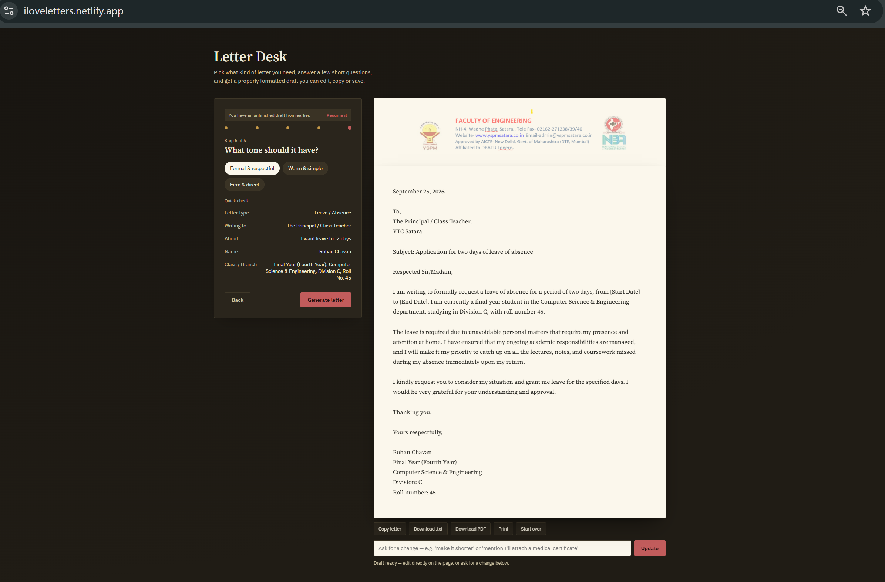

# ✉️ Letter Desk — AI Powered Letter Generator

Letter Desk is a simple AI-powered web application that helps users generate professional and personal letters instantly using AI.

---

## 🌐 Live Demo

👉 https://iloveletters.netlify.app/

---

## Screenshot




## 🚀 How to Run This Project Locally

### 1. Clone the Repository

```bash
git clone https://github.com/your-username/letter-desk.git
cd letter-desk
```

### 2. Install Dependencies

```bash
npm install
```

### 3. Set Up Environment Variables

Create a `.env` file in the root directory and add:

```env
GEMINI_API_KEY=your_api_key_here
```

> ⚠️ Never share your API key publicly

---

### 4. Run Netlify Functions Locally

Install Netlify CLI (if not installed):

```bash
npm install -g netlify-cli
```

Run the project:

```bash
netlify dev
```

---

### 5. Open in Browser

```
http://localhost:8888
```

---

## ⚙️ How It Works

User → Frontend (index.html) → Netlify Function → Gemini API → Generated Letter → User

---

## 🛠 Tech Stack

* HTML (with embedded CSS & JavaScript)
* Node.js
* Netlify Functions (Serverless)
* Gemini API

---

## 📁 Project Structure

```
letter-desk/
│── public/
│   └── index.html   (contains HTML + CSS + JS)
│── netlify/
│   └── functions/
│       └── generateLetter.js
│── netlify.toml 
│── README.md
```

---

## 📌 Features

* AI-powered letter generation
* Simple single-page application
* Fast serverless backend
* Clean UI with integrated logic

---

## ❗ Note

If the Gemini API is not responding:

* Check your API key
* Free tier may hit limits (503 errors)
* Retry after some time

---

## 📈 Future Improvements

* Separate CSS and JS for better scalability
* Add multiple templates
* Improve UI/UX
* Add download (PDF/TXT)

---

## 🙌 Acknowledgement

This project helped me understand real-world concepts like:

* API integration
* Serverless deployment
* Debugging production issues
* Handling API failures and retries
